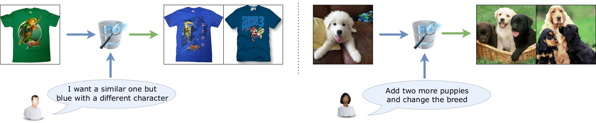
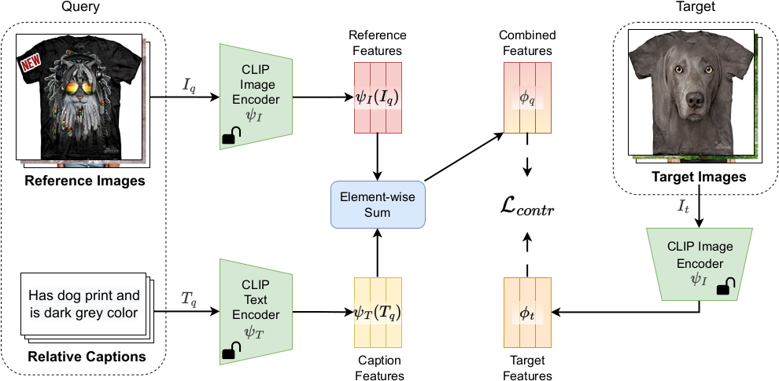
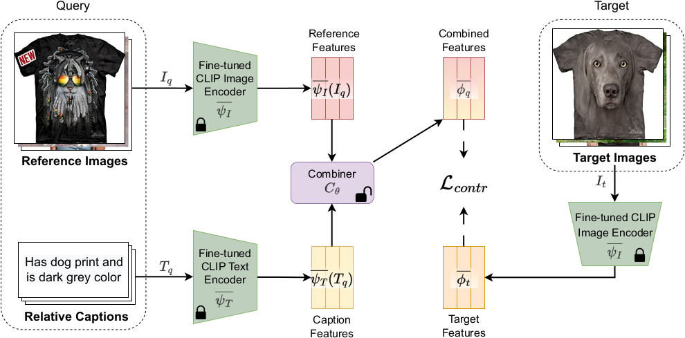
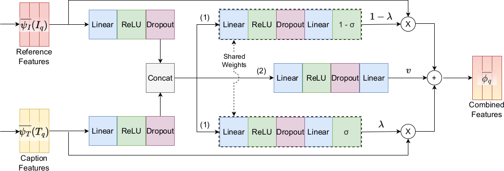

# OpenAI CLIP based Image Retrieval 

### CLIP for Composed image retrieval

### Composed image retrieval task



The left portion of the illustration depicts a specific case of composed image retrieval in the fashion domain, where
the user imposes constraints on the character attribute of a t-shirt. Meanwhile, the right part showcases an example 
where the user asks to alter objects and their cardinality within a real-life image.
### CLIP task-oriented fine-tuning 



First stage of training. In this stage, we perform a task-oriented fine-tuning of CLIP encoders to reduce the mismatch 
between the large-scale pre-training and the downstream task. We start by extracting the 
 image-text query features and combining them through an element-wise sum. We then employ a contrastive loss 
to minimize the distance between combined features and target image features in the same triplet and maximize the 
distance from the other images in the batch. We update the weights of both CLIP encoders.
### Combiner training 



Second stage of training. In this stage, we train from scratch a Combiner network that learns to fuse the multimodal 
features extracted with CLIP encoders. We start by extracting the image-text query features using the fine-tuned 
encoders, and we combine them using the Combiner network. We then employ a contrastive loss to minimize the distance 
between combined features and target image features in the same triplet and maximize the distance from the other images 
in the batch. We keep both CLIP encoders frozen while we only update the weights of the Combiner network.
At inference time the fine-tuned encoders and the trained Combiner are used to produce an effective representation used 
to query the database.

### Combiner architecture



Architecture of the Combiner network $C_{\theta}$. It takes as input the multimodal query features and outputs a unified
representation. $\sigma$ represents the sigmoid function. We denote the outputs of the first branch (1) as $\lambda$ 
and $1 -\lambda$, while the output of the second branch (2) as $v$. The combined features are $\overline{\phi_q} = (1 - \lambda)* \overline{\psi_{I}}(I_q) + \lambda * \overline{\psi_{T}}(T_q) + v$
### Abstract

Given a query composed of a reference image and a relative caption, the Composed Image Retrieval goal is to retrieve 
images visually similar to the reference one that integrates the modifications expressed by the caption. Given that 
recent research has demonstrated the efficacy of large-scale vision and language pretrained (VLP) models in various 
tasks, we rely on features from the OpenAI CLIP model to tackle the considered task. We initially perform a task-oriented 
fine-tuning of both CLIP encoders using the element-wise sum of visual and textual features. Then, in the second stage, 
we train a Combiner network that learns to combine the image-text features integrating the bimodal information and 
providing combined features used to perform the retrieval. We use contrastive learning in both stages of training. 
Starting from the bare CLIP features as a baseline, experimental results show that the task-oriented fine-tuning and 
the carefully crafted Combiner network are highly effective and outperform more complex state-of-the-art approaches on 
FashionIQ and CIRR, two popular and challenging datasets for composed image retrieval.
### Built With

* [Python](https://www.python.org/)
* [PyTorch](https://pytorch.org/)
* [CLIP](https://github.com/openai/CLIP)
* [Comet](https://www.comet.ml/site/)

## Getting Started

To get a local copy up and running follow these simple steps.

### Prerequisites

We strongly recommend the use of the [**Anaconda**](https://www.anaconda.com/) package manager to avoid
dependency/reproducibility problems.
A conda installation guide for Linux systems can be
found [here](https://docs.conda.io/projects/conda/en/latest/user-guide/install/linux.html)

### Installation

1. Clone the repo

```sh
git clone https://github.com/ABaldrati/CLIP4Cir
```

2. Install Python dependencies

```sh
conda create -n clip4cir -y python=3.8
conda activate clip4cir
conda install -y -c pytorch pytorch=1.11.0 torchvision=0.12.0
conda install -y -c anaconda pandas=1.4.2
pip install comet-ml==3.21.0
pip install git+https://github.com/openai/CLIP.git
```

## Usage

Here's a brief description of each file under the ```src/``` directory:

For running the following scripts in a decent amount of time, it is **heavily** recommended to use a CUDA-capable GPU.
It is also recommended to have a properly initialized Comet.ml account to have better logging of the metrics
(all the metrics will also be logged on a csv file).

* ```utils.py```: utils file
* ```combiner.py```: Combiner model definition
* ```data_utils.py```: dataset loading and preprocessing utils
* ```clip_fine_tune.py```: CLIP task-oriented fine-tuning file
* ```combiner_train.py```: Combiner training file
* ```validate.py```: compute metrics on the validation sets
* ```cirr_test_submission.py```: generate test prediction on cirr test set

**N.B** The purpose of the code in this repo is to be as clear as possible. For this reason, it does not include some optimizations such as gradient checkpointing (when fine-tuning CLIP) and feature pre-computation (when training the Combiner network)